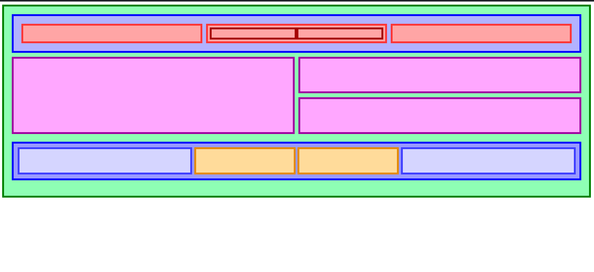
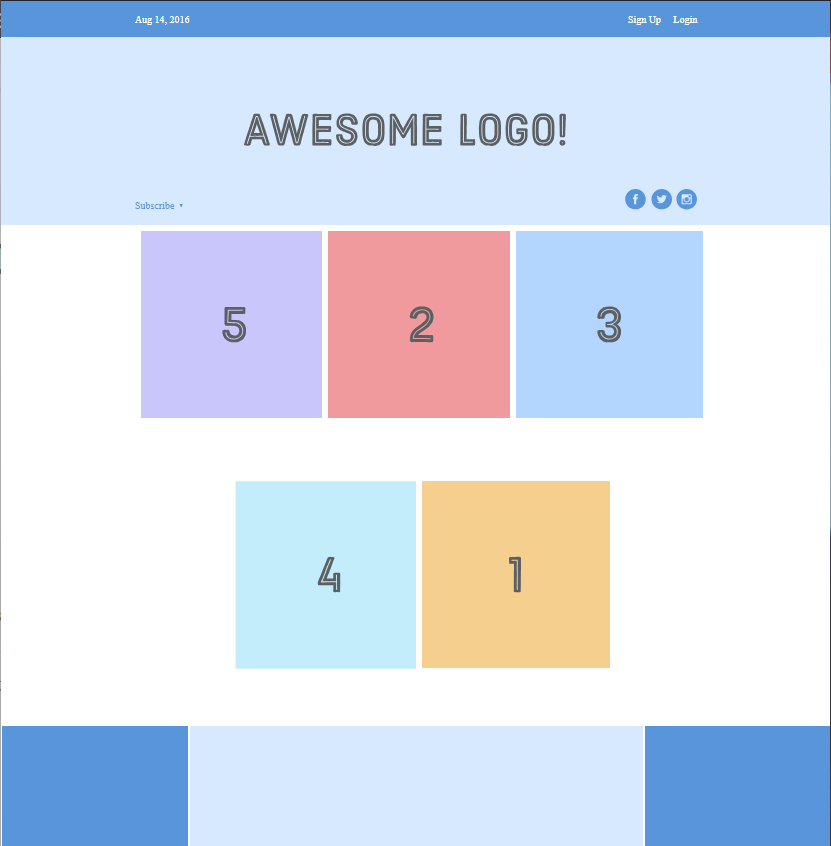

FLEXBOX

Exercise using Flexbox:

My result: 

It's not perfect, but little by little we'll keep progressing. We keep working!!.

EXERCISE 2.
Learn the basics concepts of the properties of flexbox and i did a example project.

The result is:

